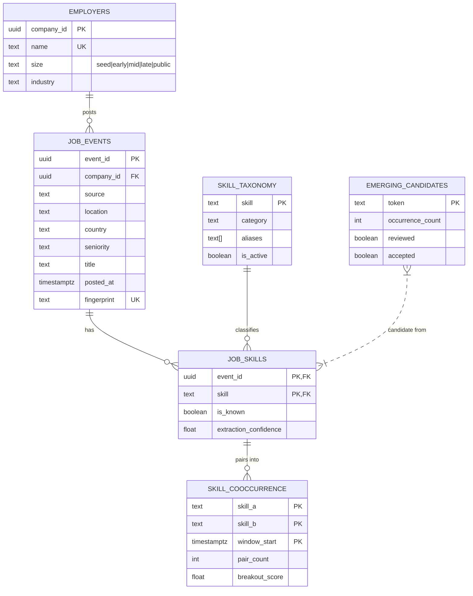

# Signum — Architecture & DBMS Documentation

Signum is a **real-time job-market intelligence system** built on a TimescaleDB
event store. It ingests *live* job postings from public sources, extracts skills
with an NLP pipeline, maintains a **custom bitmap index** for fast multi-filter
queries, and computes a **breakout signal** that surfaces emerging skill
combinations before they become mainstream.

> All data is real. Sources: Remotive API, Arbeitnow API (key-less), and
> Naukri via Firecrawl (India-specific, key optional). No synthetic data.

## Entity-Relationship Diagram

## Normalization

Schema is in **3NF**:
- No repeating groups (skills are a separate `job_skills` table, not an array on
  `job_events`).
- Every non-key attribute depends on the full primary key.
- No transitive dependency on the key.

**Rejected denormalization:** storing skills as a `JSONB` array on `job_events`
would make aggregation queries (`GROUP BY skill`, co-occurrence self-joins)
slower and prevent the bitmap index from tracking skills independently. We chose
normalized tables for query performance on aggregations.

## TimescaleDB

- `job_events` is a **hypertable** on `posted_at` → automatic time partitioning.
- `skill_cooccurrence` is a hypertable on `window_start`.
- `cooccurrence_30d` is a **continuous aggregate** (materialized view) that
  recomputes the 30-day co-occurrence window incrementally on ingest — this is
  what makes the breakout signal sub-second.

## Custom Bitmap Index

Implemented in `app/infrastructure/indexing/bitmap.py`. Each distinct value of
`skill`, `seniority`, `country`, `company_size` owns one Redis bitstring — one
bit per posting (its sequential posting number). A multi-filter AND is a `BITOP
AND` across the relevant bitstrings, then a single read.

Cost: `O(rows / 64)` regardless of filter count. B-tree intersection cost grows
with each added filter (`O(k log n)`), so the bitmap index wins by a widening
margin as filters increase — see `docs/benchmark.md`.

## Transaction Boundaries

Each posting ingestion is atomic: insert `job_events` + insert `job_skills` +
update bitmap + record emerging candidates, all in one commit. A partial insert
would corrupt co-occurrence counts and the bitmap, so the whole batch rolls back
on `IntegrityError`.
